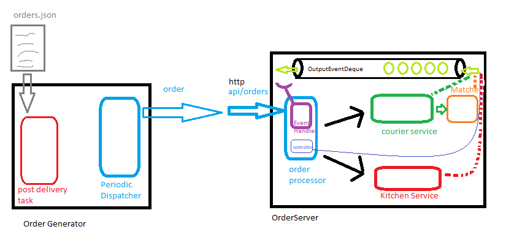

# Food Delivery Backend
This is a real time simulator of a food delivery order systems.

# Run
 
#### Pre-requisites
- Java JDK 11 or higher is installed https://adoptopenjdsk.net/installation.html
- Test the installation with this command ```java -version```

### [Unix systems or Windows Git Bash terminal]
The system has two components a server and an order generator:

1. Build the jar files run the command (This will build both systems):

    ```./mvnw clean package > build-result.orig && less -12 build-result.orig```
    
    **Note:** The output is directed to a file to improve execution time.

   #### Server Optional Arguments

   |Name|Description|Values|Default|
       |---|---|---|---|
   |strategy|the source of the orders to load in the system| *fifo* or *matched*|fifo|
   |--|--|--|--|

3. Start the server
    ```java -jar orderserver/target/orderserver-1.0.jar  <SERVER_OPTIONAL_ARGS>```

4. Start the order generator system (see the args table)
    ```java -jar orderserver/target/orderserver-1.0.jar <GENERATOR_OPTIONAL_ARGS>```
    
    #### Generator Optional Arguments
    
    |Name|Description|Values|
    |---|---|---|
    |order_source|the source of the orders to load in the system| *tiny*, *small*, *large* or your_own_file|

    
    * **tiny**: points to default 5 order file within the system
    * **small**: points to default 24 order file within the system
    * **large**: points to default 129600 order file, equivalent to 24hrs (assuming 2 orders dispatched per second.
    * **your_own_file**: provide a full path of your json file containing an array of Orders e.g. */mypath/to/file/orders.json*
    
    e.g.
    ```java -jar orderserver/target/orderserver-1.0.jar /mypath/to/file/orders.json```
    
### [Windows (CMD)]:
Replace the command ```./mvnw``` for ```mvnw.cmd```.

# Considerations

### Couriers
- The system loads a total of 10 couriers available.
- After dispatch the courier transits to "dispatched" state.
- The dispatching of couriers are based on the defined strategy:
    ###### FIFO
    Every courier is dispatched to pick up any order available in the kitchen, on first come, first served basis.

    ###### Matched
    Every courier is dispatched to pick a specific order.

- After a courier delivers an order it transits back to "available".

### Orders
- This system dispatches the given orders at a rate of two orders per second.
- The orders are received on a queue and can be discarded if no courier is available for pickup.

## Architecture
The system works based on events published in a non-blocking notification queue, and a central order system that receives the events and calls the relevant components accordingly on each event.



### 1. OrderGenerator
1. Reads the orders from a defined json file containing an array of orders.
    ```[{"id":"id_of_order", "":"", "prepTime": 4}...]```
2. The orders are sent through http to the OrderServer by the PeriodicDispatcher running periodically every 500L Milliseconds, creating a task that contains a single order.
3. This operates in Fire and Forget mode, any response errors beyond Http.BAD_REQUEST(400) will make the server to stop.

### 2. OrderServer
#### 2.1. OrderProcessor [OrderProcessor.java](orderserver/src/main/java/com/acabra/orderfullfilment/orderserver/core/OrderProcessor.java)
1. The main class OrderProcessor creates a ConcurrentLinkedDeque and registers it to the respective dependencies (KitchenService, CourierService).
2. The OrderController is the REST endpoint handling the DeliveryOrders and transforming them to OutputEvent(OrderReceivedEvent) and placing them in the notification deque.
3. The server starts OrderRequestHandler(see configuration) threads consuming tasks from the deque, and passing them back to the OrderProcessor. The mechanism implemented is polling with no blocking.
4. The OutputEventHandlers finish execution when they read an Event with type SHUT_DOWN_REQUEST, that signals them to complete execution. 
5. The OrderProcessors also starts a thread  **startNoMoreOrdersMonitor** monitoring the queue and when detecting no more orders are present signals the shutdown of the OutputEventHandlers the monitoring uses the concept of RetryBudget that control the amount of retries (see configuration)

#### 2.2 KitchenService [KitchenService.java](orderserver/src/main/java/com/acabra/orderfullfilment/orderserver/kitchen/KitchenService.java)
This service is responsible for meal preparation, it allows orders to be prepared with a previously requested reservationId, this allows the caller to ensure a courier is available to deliver the order

#### 2.3 CourierDispatchService [CourierDispatchService.java](orderserver/src/main/java/com/acabra/orderfullfilment/orderserver/courier/CourierDispatchService.java)
1. Dispatch couriers (see configuration) and publishes the CourierDispatchedEvent to the notification deque.
2. Relies on an implementation of the CourierFleet interface to handle the available drivers.
3. Relies on an implementation of the [OrderCourierMatcher.java](orderserver/src/main/java/com/acabra/orderfullfilment/orderserver/courier/matcher/OrderCourierMatcher.java).java interface to match orders to couriers

#### 2.4 NotificationDeque
1. The notification deque holds events implementing the abstract class [OutputEvent](orderserver/src/main/java/com/acabra/orderfullfilment/orderserver/event/OutputEvent.java)

##### Output Events
|Event|Type|Published By|
|---|---|---|
|OrderReceivedEvent|ORDER_RECEIVED|OrderRequestHandler class after transforming the incoming objects through Http Post.|
|CourierDispatchedEvent|COURIER_DISPATCHED|the CourierFleet indicating that a Courier has been dispatched.|
|OrderPreparedEvent|ORDER_PREPARED|the KitchenService indicates a meal is ready for pickup.|
|CourierArrivedEvent|COURIER_ARRIVED|the CourierService indicates that the courier arrived to pick up an order.|
|OrderPickedUpEvent|ORDER_PICKED_UP|OrderCourierMatcher indicating an order was picked up (after the assignment was completed).|
|OrderDeliveredEvent|ORDER_DELIVERED|Indicates the order was delivered (emulated as orders are delivered instantaneously as soons as they are picked up).|
|OutputEvent|NO_PENDING_ORDERS|OrderMonitoring task indicating the queue has been without orders for as many retries as configured (see configuration).|

## Configuration
For a detail of the configuration of the server system take a look at [application.properties](orderserver/src/main/resources/application.properties)

|name|description|values
|---|---|---|
|orderserver.strategy=fifo|determines the strategy to be used when dispatching couriers|fifo, matched|
|orderserver.thread-count|the total amount of threads to concurrently poll events from the notification queue|must be greater than 0 and its bound by the available processors|
|orderserver.period-shut-down-monitor-millis|time in seconds for checking if there are pending orders on the queue|time in millis|
|orderserver.polling-max-retries|The total amount of retries available before attempting to shut down the consumer threads|recommended 6|
|orderserver.polling-time-millis|The sleep time of concurrent threads after polling the notification queue|recommended 8000|
|courier.min-eta|courier travel time min boundary for the uniformly distribution of random times taken|3|
|courier.max-eta|courier travel time max boundary for the uniformly distribution of random times taken|15|

It is possible to run the server with a different configuration by launching the application with the parameter **--spring.config.location**
e.g.
```java -jar orderserver/target/orderserver-1.0.jar --spring.config.location=/fullpath/to/file/application.properties```